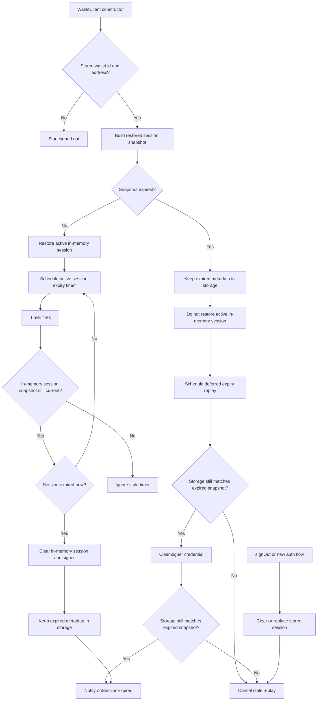

# Session Expiry Flow

This note documents the wallet session expiry flow for maintainers. Public API behavior is covered in `API.md`; this file focuses on how restored, active, and stale expiry paths are coordinated.

## Behavior Contract

- A valid stored session is restored into memory and gets an expiry timer.
- An expired stored session is not restored as active, but its metadata stays in storage so `onSessionExpired` can replay after a page refresh.
- Active sessions can expire from the timer or from a protected wallet operation checking the session before use.
- `signOut()` or a new auth flow clears or replaces stored session metadata, which cancels stale expired-session replay.

## Flow

